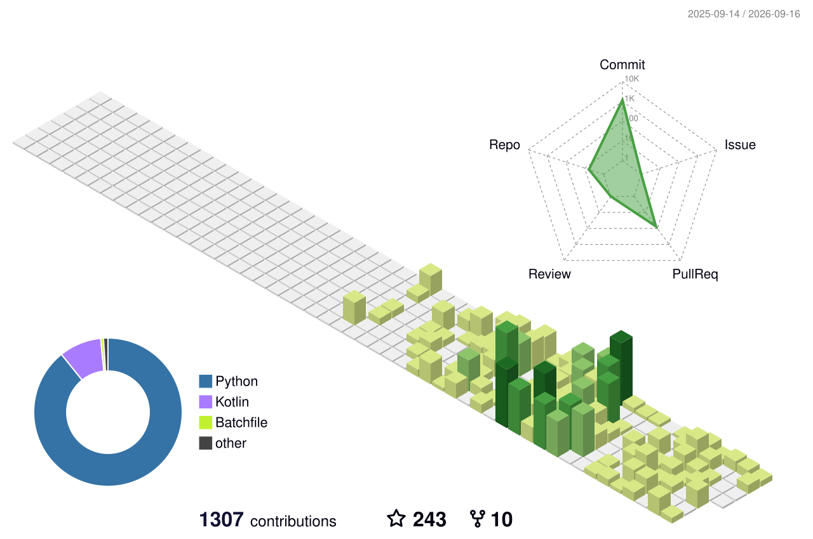

## 🌱 GitHub Contributions

## 🚀 Projects Created

### [Project Monitorize](https://github.com/vinnavannewton/project-monitorize)

Monitorize is a linux software that lets you use any device as an extended display.

## 🤝 Projects Contributed To

### [RetroMusicPlayer](https://github.com/RetroMusicPlayer/RetroMusicPlayer)

 A famous open-source Android music player.

### [plasmavantage](https://gitlab.com/Scias/plasmavantage)

A kde widget that provides additional options for legion laptops.

